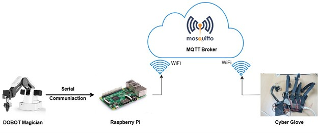
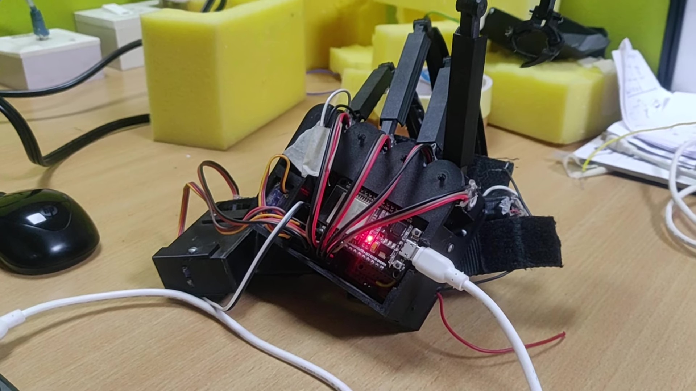
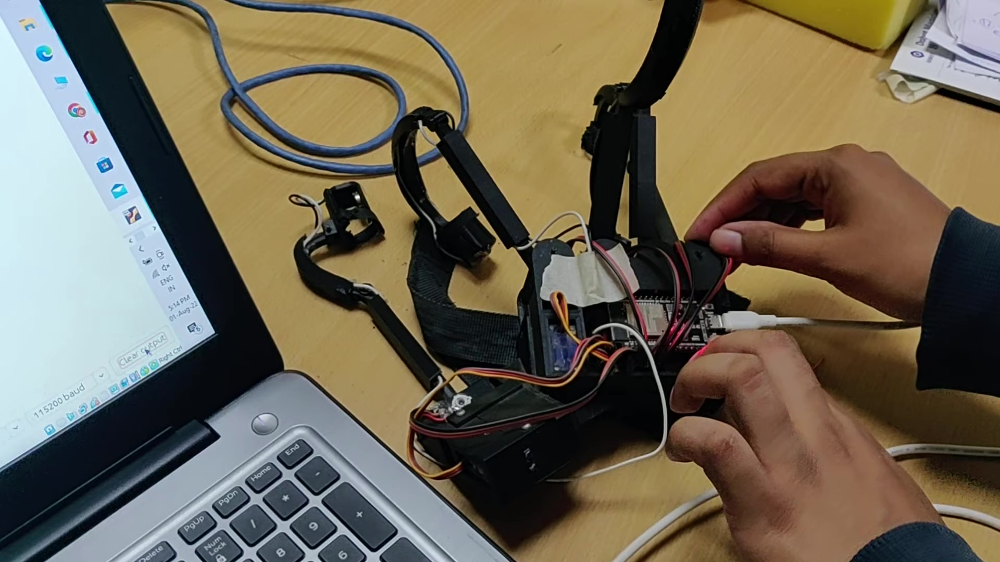
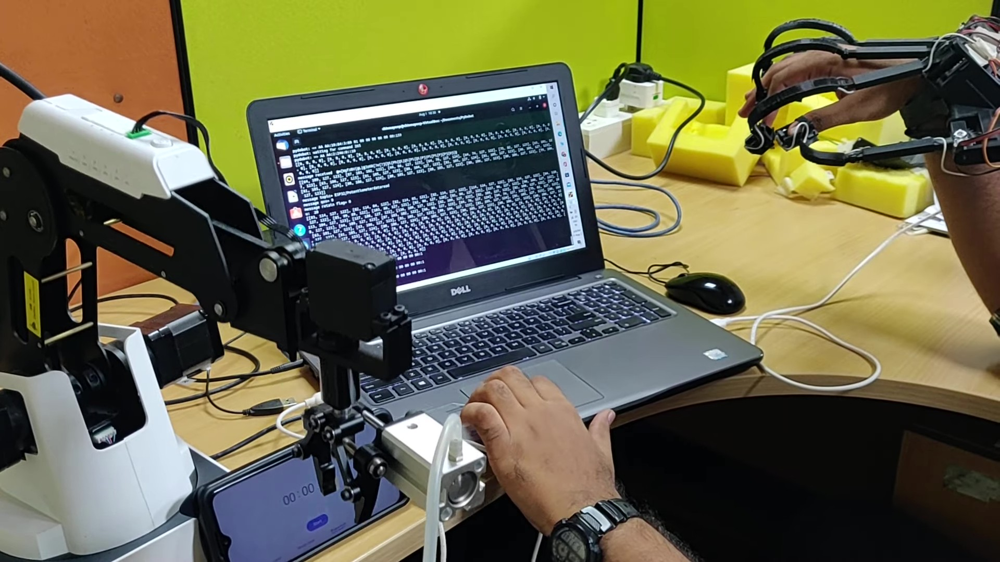
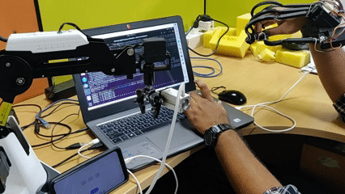

# Cyberglove Teleoperation

A real-time teleoperation system that uses a sensor-equipped cyber glove to remotely control a Dobot robotic arm. The system captures hand movements and finger positions through flex sensors and an IMU, transmitting the data wirelessly via MQTT to control a robotic gripper with precision.



## Table of Contents
- [Overview](#overview)
- [Features](#features)
- [System Architecture](#system-architecture)
- [Hardware Components](#hardware-components)
- [Software Components](#software-components)
- [Circuit Diagram](#circuit-diagram)
- [3D Printed Components](#3d-printed-components)
- [Installation](#installation)
- [Usage](#usage)
- [MQTT Communication](#mqtt-communication)
- [Directory Structure](#directory-structure)
- [Dependencies](#dependencies)
- [License](#license)

## Overview

The Cyberglove Teleoperation system enables intuitive remote control of robotic manipulators through natural hand movements. The system consists of:

1. **Cyber Glove**: A wearable device with flex sensors that measure finger joint angles (0-107 degrees) and an MPU6050 IMU for hand orientation tracking
2. **ESP32 Microcontroller**: Processes sensor data and transmits it via MQTT protocol
3. **MQTT Broker**: Handles wireless communication between the glove and robot controller
4. **Robot Controller**: Python-based controller that receives commands and operates the Dobot robotic arm
5. **Feedback System**: Provides force feedback via servos and tactile feedback via vibration motors




## Features

### Sensing Capabilities
- **5-Finger Joint Angle Tracking**: Independent measurement for thumb, index, middle, ring, and little fingers
- **Hand Orientation Tracking**: Real-time roll, pitch, and yaw angles using MPU6050 IMU
- **Second-Order Butterworth Filter**: Applied to sensor readings for noise reduction
- **20-Sample Moving Average**: Additional smoothing for potentiometer readings

### Control Features
- **Real-Time Teleoperation**: Low-latency control via MQTT protocol
- **Workspace Limitation**: Safety constraints (195-270mm radial workspace, 0-150mm vertical range)
- **Gripper Control**: Open/close gripper based on finger position
- **Web Interface**: Real-time visualization of joint angles and orientation via WebSocket

### Feedback Systems
- **Force Feedback**: Servo motors provide resistance when gripping objects
- **Tactile Feedback**: Vibration motors simulate touch sensations
- **Visual Feedback**: Web-based dashboard showing all sensor values


## System Architecture

The system uses a distributed architecture with the following components:

```
┌─────────────────┐         ┌──────────────┐         ┌─────────────────┐
│   Cyber Glove   │         │     MQTT     │         │  Dobot Robot    │
│   (ESP32)       │◄───────►│    Broker    │◄───────►│  Controller     │
│  - Flex Sensors │  WiFi   │              │  WiFi   │  (Python)       │
│  - IMU (MPU6050)│         │              │         │  - pydobot      │
│  - Servos       │         │              │         │  - paho-mqtt    │
│  - Vibrators    │         │              │         │                 │
└─────────────────┘         └──────────────┘         └─────────────────┘
        │                                                      │
        │                                                      │
        ▼                                                      ▼
┌─────────────────┐                              ┌─────────────────┐
│  Web Interface  │                              │  Robot Actions  │
│  (WebSocket)    │                              │  - Move (X,Y,Z) │
│  - Joint Angles │                              │  - Grip/Release │
│  - Orientation  │                              │  - Workspace    │
└─────────────────┘                              └─────────────────┘
```


## Hardware Components

### Cyber Glove Components

| Component | Model/Type | Quantity | Purpose |
|-----------|-----------|----------|---------|
| Microcontroller | ESP32 | 1 | Main processor for sensor reading and communication |
| IMU | MPU6050 | 1 | Measures hand orientation (roll, pitch, yaw) |
| Flex Sensors | Analog Potentiometers | 5 | Measure finger joint angles |
| Servo Motors | Standard Servo | 2 | Provide force feedback (thumb & index) |
| Vibration Motors | DC Vibration Motors | 2 | Provide tactile feedback |
| 3D Printed Parts | PLA/ABS | Multiple | Mechanical structure and sensor mounting |


### Pin Configuration (ESP32)

**Analog Input Pins (Flex Sensors):**
- GPIO 36: Thumb sensor
- GPIO 39: Index finger sensor
- GPIO 34: Middle finger sensor
- GPIO 35: Ring finger sensor
- GPIO 32: Little finger sensor

**Servo Control Pins:**
- GPIO 25: Thumb servo
- GPIO 33: Index finger servo

**Vibration Motor Pins:**
- GPIO 2: Thumb vibration motor
- GPIO 4: Index finger vibration motor

**IMU Interface:**
- GPIO 21: SDA (I2C Data)
- GPIO 22: SCL (I2C Clock)
- GPIO 5: Interrupt pin

**Status LED:**
- GPIO 17: System status LED

## Software Components

### 1. Cyber Glove Firmware
- **File**: `Cyber Glove/Project_iot_cyber_glove/cyber_glove_release_sw/cyber_glove_release_sw.ino`
- **Functions**:
  - Reads 5 flex sensors with second-order Butterworth filtering
  - Processes MPU6050 IMU data using DMP (Digital Motion Processor)
  - Hosts web server for visualization (port 80)
  - WebSocket server for real-time updates (port 81)
  - Controls force and tactile feedback systems

### 2. ESP32 MQTT Publisher
- **File**: `ESP32/Mosquitto_Write/Mosquitto_Write.ino`
- **Functions**:
  - Reads 4 potentiometer values (X, Y, Z, Gripper)
  - Applies 20-sample moving average filter
  - Maps sensor values to 0-127 range
  - Publishes data to MQTT topic `ESP32/Potentiometerdataread` every 5 seconds

### 3. Dobot Robot Controller
- **File**: `Dobot/PahoFinal.py`
- **Functions**:
  - Subscribes to MQTT topic for glove data
  - Maps sensor values to robot workspace coordinates
  - Enforces workspace constraints (195-270mm radial, 0-150mm height)
  - Controls Dobot arm position and gripper state
  - Uses pydobot library for robot communication

### 4. Additional Scripts
- `Dobot/FinalWspc.py`: Alternative workspace configuration
- `Dobot/PahoFinal2.py`: Alternative MQTT implementation
- `PahoConnect.py`: MQTT connection testing utility


### Sensor Calibration Values

The system uses calibration offsets for accurate angle measurement:

```cpp
// Joint Angle Offsets (raw ADC values)
const float ind_off = 878.0;   // Index finger
const float mid_off = 785.0;   // Middle finger
const float rng_off = 1179.0;  // Ring finger
const float lil_off = 950.0;   // Little finger
const float thb_off = 895.0;   // Thumb

// Joint Angle Ranges (raw ADC values)
const float ind_range = 1794.0;
const float mid_range = 1708.0;
const float rng_range = 1684.0;
const float lil_range = 1845.0;
const float thb_range = 1958.0;

// Angular range in degrees
const float delta_ang = 107.0;
```

## 3D Printed Components

The cyber glove uses custom 3D printed parts for mechanical structure and sensor mounting. STL files are provided for both right-hand (default) and left-hand configurations.




### Parts List

**Finger Mechanisms:**
- `bottom holder.STL` / `top holder.STL`: Main mounting brackets
- `mid_ring_ind_finger link.STL`: Link mechanism for index, middle, ring fingers
- `mid_ring_ind_finger cover.STL`: Protective cover
- `little finger link.STL` / `little finger cover.STL`: Little finger mechanism
- `thumb attachment.STL` / `thumblink.STL`: Thumb mechanism
- `thumb upper holder.STL` / `thumb lower holder.STL`: Thumb mounting
- `thumb cover.STL` / `thbl2cvr.STL`: Thumb protective covers

**Sensor Mounts:**
- `finger tip version1.STL`: Fingertip sensor housing
- `tip with mot.STL`: Motorized fingertip
- `rachet_joint.STL`: Ratcheting joint mechanism
- `rachet link.STL` / `rachet link cover.STL`: Ratchet link assembly

**Electronics Housing:**
- `pcbholder.STL`: PCB mounting bracket
- `cover plate.STL`: Electronics cover
- `slider2.STL` / `slide1_1_1.STL` / `slide_1_1_2.STL`: Adjustment sliders

**Left-Hand Version:**
All parts are available in mirrored versions in the `STL_Files_Left_Hand/` directory.

### Printing Recommendations

- **Material**: PLA or ABS
- **Layer Height**: 0.2mm
- **Infill**: 20-30%
- **Supports**: Required for some parts
- **Print Orientation**: Follow guidelines in `STL_Files_Left_Hand/Readme cyber glove prints.pdf`


## Installation

### Hardware Setup

1. **3D Print Components**
   - Print all required STL files from the `Cyber Glove/cyber glove/` directory
   - Use appropriate material (PLA/ABS) with 20-30% infill
   - Refer to `STL_Files_Left_Hand/Readme cyber glove prints.pdf` for printing guidelines

2. **Assemble Cyber Glove**
   - Mount flex sensors in finger mechanisms
   - Install MPU6050 IMU on the back of hand
   - Connect servos for force feedback
   - Install vibration motors
   - Wire all components to ESP32 according to pin configuration

3. **Connect Dobot Robot**
   - Connect Dobot arm to computer via USB (typically `/dev/ttyUSB2` on Linux)
   - Ensure robot is powered and initialized



### Software Setup

#### 1. ESP32 Firmware

Install required libraries in Arduino IDE:
```bash
# Arduino Libraries needed:
- WiFi (built-in)
- PubSubClient
- ArduinoJson
- WebSocketsServer
- ESP32Servo
- MPU6050 (I2Cdev library)
```

Configure WiFi and MQTT:
```cpp
// In cyber_glove_release_sw.ino or Mosquitto_Write.ino
const char* ssid = "YOUR_WIFI_SSID";
const char* password = "YOUR_WIFI_PASSWORD";
const char* mqtt_server = "YOUR_MQTT_BROKER_IP";
```

Upload firmware to ESP32.

#### 2. MQTT Broker

Install Mosquitto MQTT broker:
```bash
# Ubuntu/Debian
sudo apt-get update
sudo apt-get install mosquitto mosquitto-clients

# macOS
brew install mosquitto

# Start the broker
mosquitto -v
```

Or use a cloud MQTT broker:
- `broker.mqtt-dashboard.com`
- `broker.emqx.io`

#### 3. Python Environment

Install Python dependencies:
```bash
pip install pydobot paho-mqtt
```

For Dobot robot, you may need additional setup:
```bash
# Linux: Add user to dialout group for USB access
sudo usermod -a -G dialout $USER
```

Configure Python script:
```python
# In Dobot/PahoFinal.py
broker_address = "YOUR_MQTT_BROKER_IP"  # e.g., "192.168.1.100"
port = "/dev/ttyUSB2"  # Adjust for your system (COM port on Windows)
```

## Usage

### 1. Start MQTT Broker

```bash
mosquitto -v
```

### 2. Power On Cyber Glove

- Power the ESP32 (via USB or battery)
- Wait for WiFi connection (check Serial Monitor)
- Note the IP address displayed

### 3. Access Web Interface

Open a browser and navigate to the ESP32's IP address:
```
http://[ESP32_IP_ADDRESS]
```

The interface displays:
- Real-time finger joint angles
- Hand orientation (roll, pitch, yaw)
- Force feedback status
- Tactile feedback status
- Control buttons for feedback activation



### 4. Start Robot Controller

```bash
cd Dobot
python PahoFinal.py
```

The script will:
- Connect to MQTT broker
- Move Dobot to home position (234, 0, 75, 0)
- Subscribe to glove data
- Begin real-time teleoperation

### 5. Operate the System

- Move your hand to control robot position
- Finger movements map to X, Y, Z coordinates
- Close fingers to activate gripper
- System enforces workspace constraints for safety

### Control Mapping

| Glove Input | Robot Output | Range |
|-------------|--------------|-------|
| X-axis finger angle | Robot X position | 195-270mm |
| Y-axis finger angle | Robot Y position | 195-270mm |
| Z-axis finger angle | Robot Z position | 0-150mm |
| Gripper sensor | Gripper state | Open/Close |
| Hand roll/pitch/yaw | (Future: Wrist orientation) | ±180° |

## MQTT Communication

### Topic Structure

- **Publisher**: ESP32 Cyber Glove
- **Topic**: `ESP32/Potentiometerdataread`
- **Subscriber**: Python Robot Controller
- **Message Format**: 4-byte character array `[X, Y, Z, Gripper]`
- **Update Rate**: Every 5 seconds
- **QoS Level**: 0 (At most once)

### Data Format

```
Message: [dx, dy, dz, dg]
  dx: X-axis value (0-127)
  dy: Y-axis value (0-127)
  dz: Z-axis value (0-127)
  dg: Gripper value (0-127)
    - dg ≤ 63: Grip closed
    - dg > 63: Grip open
```

### Coordinate Transformation

```python
# Sensor to robot workspace mapping
xa = (dx * 270) / 127  # Map to 0-270mm
ya = (dy * 270) / 127
za = (dz * 150) / 127  # Map to 0-150mm

# Workspace validation
radius = sqrt(xa² + ya²)
if 195 <= radius <= 270 and 0 <= za <= 150:
    # Valid workspace - execute movement
    device.move_to(xa, ya, za, r, wait=True)
```

## Directory Structure

```
Cyberglove-Teleoperation/
├── Cyber Glove/
│   ├── Project_iot_cyber_glove/
│   │   ├── cyber_glove_release_sw/          # Main cyber glove firmware
│   │   ├── robot_gripper_release_sw/        # Gripper control firmware
│   │   ├── Readme.pdf                       # Hardware documentation
│   │   ├── presentation_HW_SW_architecture.pdf
│   │   └── system_schematic.pdf             # System wiring diagram
│   └── cyber glove/                         # 3D model STL files (right hand)
│       ├── bottom holder.STL
│       ├── top holder.STL
│       └── [... other STL files]
├── STL_Files_Left_Hand/                     # 3D model STL files (left hand)
│   ├── Readme cyber glove prints.pdf        # Printing instructions
│   └── [... mirrored STL files]
├── Dobot/
│   ├── PahoFinal.py                         # Main robot controller
│   ├── PahoFinal2.py                        # Alternative implementation
│   ├── FinalWspc.py                         # Workspace utilities
│   └── FinalWspc2.py
├── ESP32/
│   ├── Mosquitto_Write/                     # MQTT publisher (simple version)
│   ├── Mosquitto_Write2/
│   ├── Mosquitto_Read/                      # MQTT subscriber test
│   ├── CloudWriteAvg/                       # Cloud MQTT implementation
│   ├── CloudReadAvg/
│   ├── Serial/                              # Serial communication test
│   └── Test_Array/                          # Array data handling test
├── PahoConnect.py                           # MQTT connection tester
├── Documentation.docx                       # Project documentation
├── LICENSE                                  # MIT License
└── README.md                                # This file
```

## Dependencies

### Hardware
- ESP32 Development Board (WROOM-32 or similar)
- MPU6050 6-axis IMU
- 5x Analog flex/potentiometer sensors
- 2x Servo motors (for force feedback)
- 2x Vibration motors (DC motors)
- Dobot Magician robotic arm
- WiFi network
- 3D printer for mechanical parts

### Software

**Arduino Libraries:**
```
WiFi
PubSubClient (MQTT)
ArduinoJson
WebSocketsServer
ESP32Servo
Wire (I2C)
I2Cdev
MPU6050 (DMP)
```

**Python Packages:**
```
pydobot>=1.3.0
paho-mqtt>=1.5.0
```

**System Requirements:**
```
Arduino IDE 1.8.x or higher (or PlatformIO)
Python 3.6 or higher
Mosquitto MQTT Broker 1.6 or higher
```

## Calibration

### Flex Sensor Calibration

1. Open `cyber_glove_release_sw.ino`
2. Read raw ADC values with fingers straight (offsets)
3. Read raw ADC values with fingers fully bent (ranges)
4. Update calibration constants:
   ```cpp
   const float ind_off = YOUR_VALUE;
   const float ind_range = YOUR_VALUE;
   // Repeat for all fingers
   ```

### IMU Calibration

Run the MPU6050 calibration sketch and update:
```cpp
mpu.setXGyroOffset(YOUR_VALUE);
mpu.setYGyroOffset(YOUR_VALUE);
mpu.setZGyroOffset(YOUR_VALUE);
mpu.setZAccelOffset(YOUR_VALUE);
```

### Workspace Calibration

Adjust robot workspace limits in `PahoFinal.py`:
```python
# Radial workspace (mm)
if 195 <= sqrt <= 270:
    # Adjust these values based on your robot

# Vertical workspace (mm)
if 0 <= za <= 150:
    # Adjust these values based on your robot
```

## Troubleshooting

**ESP32 not connecting to WiFi:**
- Verify SSID and password
- Check 2.4GHz WiFi network (ESP32 doesn't support 5GHz)
- Monitor serial output for connection status

**MQTT messages not received:**
- Verify broker is running: `mosquitto -v`
- Check broker IP address in both ESP32 and Python code
- Test with mosquitto_sub: `mosquitto_sub -t "ESP32/Potentiometerdataread"`

**Dobot not responding:**
- Check USB connection and permissions
- Verify port in Python script (e.g., `/dev/ttyUSB2`, `COM3`)
- Ensure pydobot is installed correctly

**Inaccurate sensor readings:**
- Recalibrate flex sensors
- Check for loose connections
- Verify power supply stability
- Adjust filter parameters if needed

## Future Enhancements

- [ ] Add hand orientation control for robot wrist
- [ ] Implement bilateral force feedback
- [ ] Add multiple robot support
- [ ] Develop smartphone app for monitoring
- [ ] Add gesture recognition for complex commands
- [ ] Implement machine learning for motion prediction
- [ ] Add VR/AR visualization
- [ ] Support for other robot platforms

## Contributing

Contributions are welcome! Please feel free to submit pull requests or open issues for bugs and feature requests.

## License

This project is licensed under the MIT License - see the [LICENSE](LICENSE) file for details.

## Acknowledgments

- MPU6050 DMP library by Jeff Rowberg
- pydobot library for Dobot control
- Eclipse Paho for MQTT implementation

## Contact

For questions or support, please open an issue in the GitHub repository.
